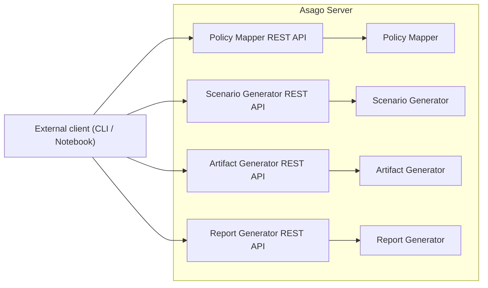
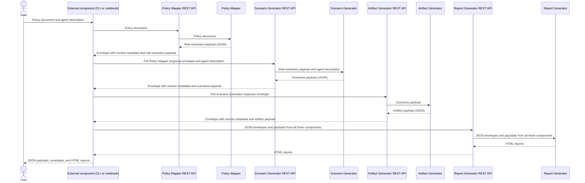

# asago - Architecture Decision Record for the asago server


|                |            |
| -------------- | ---------- |
| Date           | 1st October 2026 |
| Scope          | |
| Status         | DRAFT |
| Authors        | [Stuart Battersby](@blastStu) |
| Supersedes     | N/A |
| Superseded by: | N/A |
| Tickets        | |
| Other docs:    | none |

## What

This ADR is about exposing asago components in a unified manner via REST APIs.

## Why

At present the asago components (Policy Mapper, Scenario Generator & Artifact Generator) operate as independent Python programs.  Our end goal is a unified pipeline that can operate both locally and in a cloud/cluster environment.  The first step is creating a consistent API layer.

## Goals

* Each asago component, including the Report Generator, is accessible via a REST API

## Non-Goals

* Implementing the external caller that orchestrates the APIs into an end-to-end assessment flow. It could be a notebook example or a simple CLI.
* Logging results to an external system such as mlflow

## How

### API Server in front of components
The Asago Server exposes the Policy Mapper, Scenario Generator, Artifact Generator, and Report Generator (and future components such as the Recommender) through separate REST APIs. An external caller invokes each API, which serves its corresponding component.



### Pipeline sequence

The external caller is shown only to illustrate API usage. It could be a notebook example or a simple CLI, and its implementation is outside the scope of this ADR. A future Asago component could take on that role in separate work.

API calls are synchronous: the caller waits for each response before proceeding to the next stage. If an API call fails, the API returns HTTP 500 with a reason.

The components are stateless across API calls. Once a response is returned, the component retains no run state. The external caller is responsible for maintaining state across calls by retaining responses and passing the required data to subsequent APIs.



### API
The Policy Mapper, Scenario Generator, and Artifact Generator APIs return JSON in a lightweight envelope. The `envelope_version` identifies the wrapper format, including the component identity and payload fields. The component version identifies the producing release and defines the schema of its payload. The Report Generator REST API returns HTML reports. For each handoff, the caller passes the previous component's full response envelope to the next API, along with any additional input required for that stage. The API validates the envelope and passes the payload to its Python component. For example:

```
{
  "envelope_version": "1",
  "component": {
    "name": "policy-mapper",
    "version": "1.2.0"
  },
  "payload": {
    "risk_extraction": {}
  }
}
```

### Report generation
Report generation is currently implemented within each component. It should move to a separate Report Generator component, exposed through a REST API, that transforms JSON envelopes and payloads into HTML reports. This relies on each component conforming to the versioned payload format.

### Versioning and release
Each component should be released as a versioned Python package and included as a dependency of the server: the Policy Mapper, Scenario Generator, Artifact Generator, and Report Generator.

The server itself should have a versioned release, and an associated image built.


## Open Questions

* Should each downstream component receive the cumulative set of all prior component envelopes, or only the envelope from the immediately preceding component? For example, should the Artifact Generator receive both the Policy Mapper and Scenario Generator envelopes, or only the Scenario Generator envelope?

## Alternatives

- Kubeflow pipelines.  It is also possible to run this flow on an orchestration layer such as kubeflow pipelines.  In this scenario each individual component would be an image, passed to a kubeflow step.  However, at this stage this introduces undue complexity.  Nothing in the current approach precludes a future deployment onto kubelfow pipelines (or similar).  The work is not compute heavy (that is done via externally accessed compute at the inference endpoint), so all the work here can happen in a single job.


## Security and Privacy Considerations

- The data that flows through these APIs may well be confidential.  However this ADR is only considering the API server to access each component.  In this instance the job of security will be on the external calling component (which is outside scope of this ADR).  However, a future component that takes on this job should carefully consider data security.

- If these jobs were accessed async, and polled via some form of ID, it could be possible to access the run state and data of an unrelated job.  However, they will be synchronous and only return data once the job has completed.

## Risks

Optional section. Talk about any risks here.

## Stakeholder Impacts

| Group                         | Key Contacts     | Date       | Impacted? |
| ----------------------------- | ---------------- | ---------- | --------- |
| Policy Mapper           | key contact name | date       | ? |
| Scenario Generator          | key contact name | date       | ? |
| Artifact Generator           | key contact name | date       | ? |

## References

* optional bulleted list

## Reviews

| Reviewed by                   | Date       | Notes |
| ----------------------------- | ---------  | ------|
| name                          | date       | ? |
