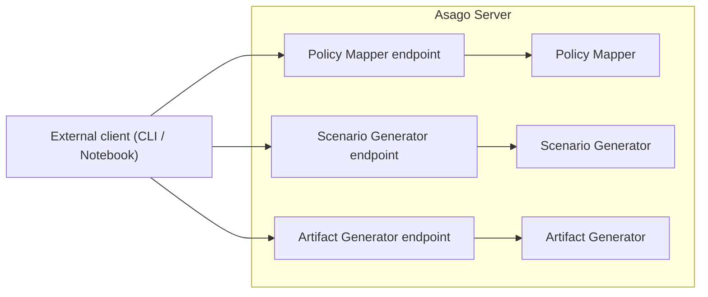
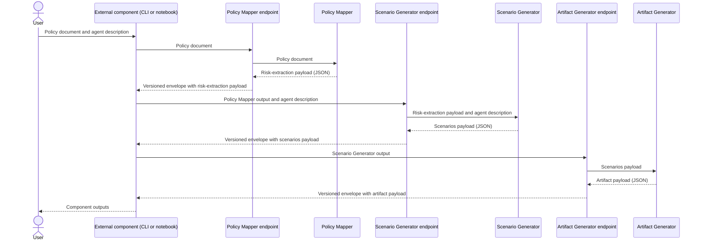

# asago - Architecture Decision Record for the asago server

|                |            |
| -------------- | ---------- |
| Date           | 1st October 2026 |
| Scope          | REST API access to existing asago components |
| Status         | DRAFT |
| Authors        | [Stuart Battersby](@blastStu), [Alessandro Beltramo](@ABeltramo) |
| Supersedes     | N/A |
| Superseded by: | N/A |
| Tickets        | |
| Other docs:    | none |

## What

One Asago Server exposes existing asago components through a consistent REST API without orchestration or retained run state.

## Why

At present the asago components (Policy Mapper, Scenario Generator & Artifact Generator) operate as independent Python programs. A consistent REST API supports both local and cloud or cluster use. One server provides this interface without a separate deployment for each component.

## Goals

* Each existing component is accessible through REST endpoints and remains independently useful.
* API endpoints and output data use versioned contracts.
* The server and its components are stateless across calls.

## Non-Goals

* The external caller owns orchestration and data storage. Its implementation is outside scope.
* Evaluation execution (such as Garak through EvalHub) remains outside scope.
* Changes to report generation belong in a separate ADR.
* External result logging, such as mlflow, remains outside scope.
* Detailed endpoint and schema definitions belong in API documentation.

## How

### API server in front of components

The Asago Server exposes one REST API with endpoints for each existing component, as shown below. The server does not orchestrate calls between components.

Each component remains independently usable as a Python package and through its endpoints. A caller can supply valid input without a prior call to another component. Independent use does not require a separate deployment.

### Illustrative API usage

This sequence illustrates one possible caller workflow. It does not require every API call to follow this order. The caller can be a notebook or CLI. Its implementation is outside this ADR.

API calls are synchronous. The caller waits for each response.

The server and its components retain no run state across API calls. Each call is data in, data out. The caller stores the outputs and supplies all required input data to each later request.

The server returns artifacts for external evaluation. The caller or another external service triggers EvalHub evaluations, for example with Garak. The server and its components do not submit or execute evaluations.

### API contracts

API endpoints and output schemas use explicit versions. The version of a component release does not define compatibility between data contracts.

Each endpoint returns JSON in a lightweight envelope with separate version metadata for the envelope and payload schema. The envelope also identifies the producer and its component release.

Each endpoint defines the input data it requires. The caller supplies that data in each request, whether it reuses an upstream response or constructs the input independently. There is no blanket requirement to forward all prior envelopes.

Each endpoint validates the input and its contract versions before it passes data to the component. Invalid input or unsupported contract versions return an appropriate 4xx response. Server failures return an appropriate 5xx response. Error responses include a reason without confidential data.

Detailed routes and schemas belong in API documentation.

### Versioning and release

Each component is released as a versioned Python package. The server includes these packages as dependencies. The server has its own versioned release and associated image.

## Alternatives

* Separate REST services for each component allow independent deployments but add deployment and operational complexity. One server provides a consistent API layer with fewer deployment units.
* Direct Python calls alone preserve independent local use but do not provide a common interface for remote callers.

Kubeflow pipelines can orchestrate calls to these endpoints. External orchestration is compatible with this decision rather than an alternative to REST exposure.

## Security and Privacy Considerations

API data can be confidential. The server or its deployment boundary must enforce access control and protect data in transit. The caller owns protection of data that it stores or passes to external systems.

Synchronous execution does not remove unauthorized access or data disclosure risks. Specific security mechanisms belong in the deployment design.

## Risks

* A shared server creates a shared operational failure boundary.
* Synchronous calls depend on client and server timeout limits.
* The caller owns orchestration and persistence, which adds work to each integration.

## Stakeholder Impacts

| Group                         | Key Contacts     | Date       | Impacted? |
| ----------------------------- | ---------------- | ---------- | --------- |
| Policy Mapper           | key contact name | date       | ? |
| Scenario Generator          | key contact name | date       | ? |
| Artifact Generator           | key contact name | date       | ? |

## References

* optional bulleted list

## Reviews

| Reviewed by                   | Date       | Notes |
| ----------------------------- | ---------  | ------|
| name                          | date       | ? |
